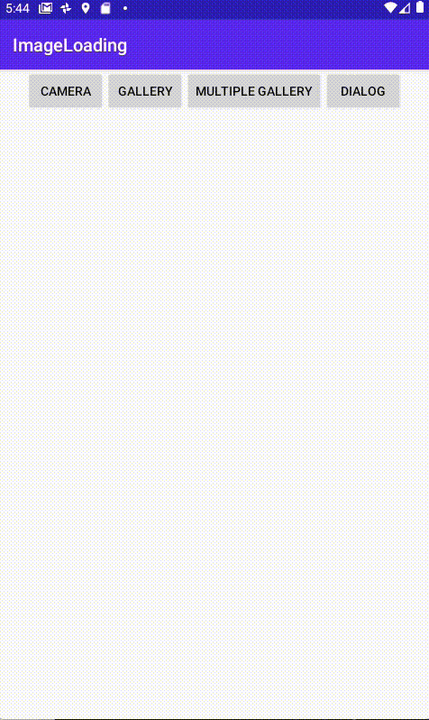

<h1 align="center">Image Loader</h1></br>

<p align="center">
Easily load image from gallery and camera
</p>

<p align="center">
<a href="https://android-arsenal.com/api?level=19">
<a href="https://opensource.org/licenses/Apache-2.0">
</a>

<p align="center">

&nbsp
&nbsp

</p>

## Setting
[  ](https://bintray.com/yunjaena/image-loader/imageloader/0.0.4/link)

### Gradle
Add below codes into `build.gradle` root project

```gradle
allprojects {
    repositories {
        jcenter()
    }
}
```

Add below codes into `build.gradle` your module

```gradle
dependencies {
    implementation 'com.yunjaena.imageloader:imageloader:0.0.4'
}
```

## How to use

Make image load ImageLoadListener
  - `onImageAdded` : onImageAdded called when the bitmap image list when loaded
  - `onImageFailed` : onImageFailed called when fail to load image

```java
ImageLoadListener imageLoadListener = new ImageLoadListener() {
      @Override
      public void onImageAdded(List<Bitmap> bitmapList) {
          // Called when image success loaded
      }

      @Override
      public void onImageFailed(ImageFailedType failedType) {
          Toast.makeText(this.getApplicationContext(), failedType.name(), Toast.LENGTH_SHORT).show();
      }
  };
```

Get image from gallery

```java
ImageLoader.with(context)
           .setImageLoadListener(imageLoadListener)
           .getImageFromGallery();
```

 Get image from camera

```java
ImageLoader.with(context)
          .setImageLoadListener(imageLoadListener)
          .getImageFromCamera();
```

Show gallery or camera select alert dialog

```java
ImageLoader.with(context)
           .setImageLoadListener(imageLoadListener)
           .showGalleryOrCameraSelectDialog();
```

## Optional

Support method

- `setImageLoadListener(ImageLoadListener imageLoadListener)`
- `setDialogStyle(@StyleRes int dialogStyle)`
- `setPermissionDenyMessage(CharSequence permissionDenyMessage)`
- `setPermissionDenyMessage(@StringRes int permissionDenyMessage)`
- `setPermissionTitle(CharSequence permissionTitle)`
- `setPermissionTitle(@StringRes int permissionTitle)`
- `setPermissionMessage(CharSequence permissionMessage)`
- `setMaxImageWarningText(@StringRes int maxImageWarningText)`
- `setMaxImageWarningText(CharSequence maxImageWarningText)`
- `setPermissionMessage(@StringRes int permissionMessage)`
- `setCameraOrGallerySelectDialogTitle(CharSequence cameraOrGallerySelectDialogTitle)`
- `setCameraOrGallerySelectDialogTitle(@StringRes int cameraOrGallerySelectDialogTitle)`
- `setCameraOrGallerySelectDialogMessage(CharSequence cameraOrGallerySelectDialogMessage)`
- `setCameraOrGallerySelectDialogMessage(@StringRes int cameraOrGallerySelectDialogMessage)`
- `setGalleryButtonText(CharSequence galleryButtonText)`
- `setGalleryButtonText(@StringRes int galleryButtonText)`
- `setCameraButtonText(CharSequence cameraButtonText)`
- `setCameraButtonText(@StringRes int cameraButtonText)`
- `setOkayButtonText(CharSequence okayButtonText)`
- `setOkayButtonText(@StringRes int okayButtonText)`
- `setCancelButtonText(CharSequence cancelButtonText)`
- `setCancelButtonText(@StringRes int cancelButtonText)`
- `setGalleryIntentText(CharSequence galleryIntentText)`
- `setGalleryIntentText(@StringRes int galleryIntentText)`
- `setMaxImage(int maxImage)` => default : 5
- `setMultiImageSelect(boolean multiImageSelect)` => default : false
- `setChangeImageSize(boolean changeImageSize)` => default : false
- `setImageHeight(int imageHeight)` => default : 200
- `setImageWidth(int imageWidth)` => default : 200

Example
- Get multiple image from gallery (max : 10) and set size 500 * 500
```java
ImageLoader.with(context)
           .setImageLoadListener(MainActivity.this)
           .setMultiImageSelect(true)
           .setMaxImage(10)
           .setChangeImageSize(true)
           .setImageHeight(500)
           .setImageWidth(500)
           .getImageFromGallery();
```

## ImageFailedType

- CANCEL : when cancel get image
- CAMERA_ERROR : camera error
- GALLERY_ERROR : gallery error
- PERMISSION_DENY : write permission deny
- FILE_ERROR : file error
- IMAGE_SIZE_CHANGE_ERROR : image size change error

## Release

### v.0.0.1
- Add image loader project
- Ask Runtime permission to write file
- Get Bitmap file from gallery
- Get Bitmap file from camera

### v.0.0.2
-  Bugfix multiple application created

### v.0.0.3
-  Bugfix file provider

### v.0.0.4
-  Add custom file provider

## Future feature
- Support RxJava

## License
```
Copyright 2020 yunjaena

Licensed under the Apache License, Version 2.0 (the "License");
you may not use this file except in compliance with the License.
You may obtain a copy of the License at

    http://www.apache.org/licenses/LICENSE-2.0

Unless required by applicable law or agreed to in writing, software
distributed under the License is distributed on an "AS IS" BASIS,
WITHOUT WARRANTIES OR CONDITIONS OF ANY KIND, either express or implied.
See the License for the specific language governing permissions and
limitations under the License.
```
